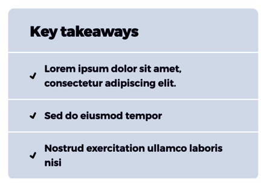
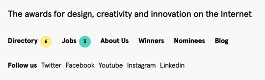

# End of Field Challenge

- Repository name: `end-of-field-challenge`
- Owner: [Muhammad Fawad Rafique](https://github.com/fawadrafique)
- Type of Challenge: `solo test`
- Tool used: `VS Code`
- Written in : `HTML and CSS`
- GitHub page: [Click here](https://fawadrafique.github.io/end-of-field-challenge/)

Challenge is to build two full integration using **HTML** and **CSS** only with precision and accuracy.

## [Interface 1](https://fawadrafique.github.io/end-of-field-challenge/simple1.html)

Create this view pixel-perfectly.

## [Interface 2](https://fawadrafique.github.io/end-of-field-challenge/simple2.html)

Create this view pixel-perfectly.

